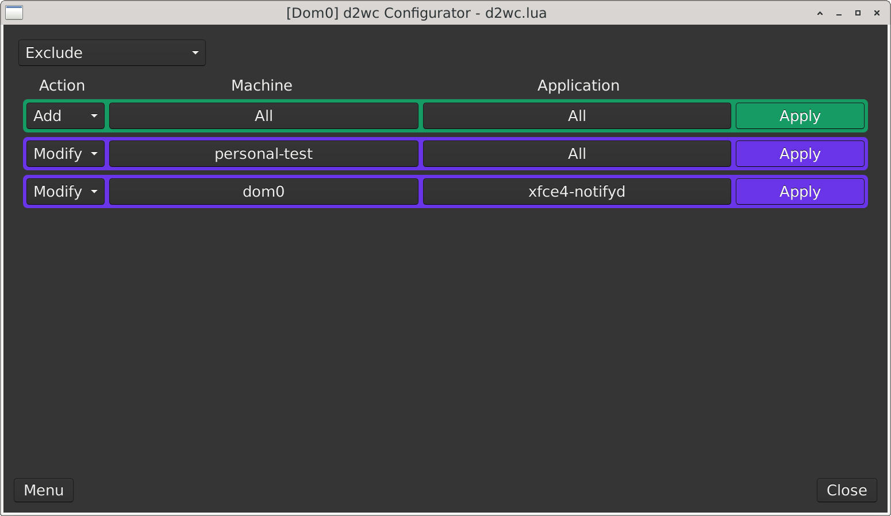
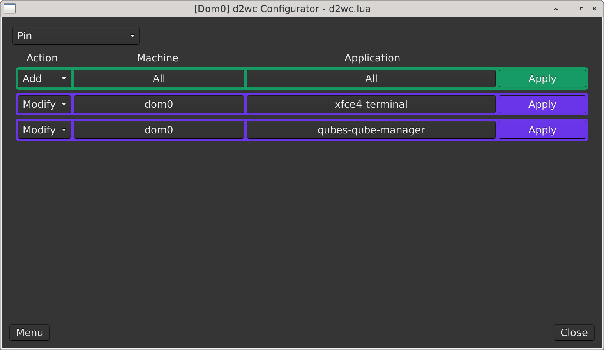
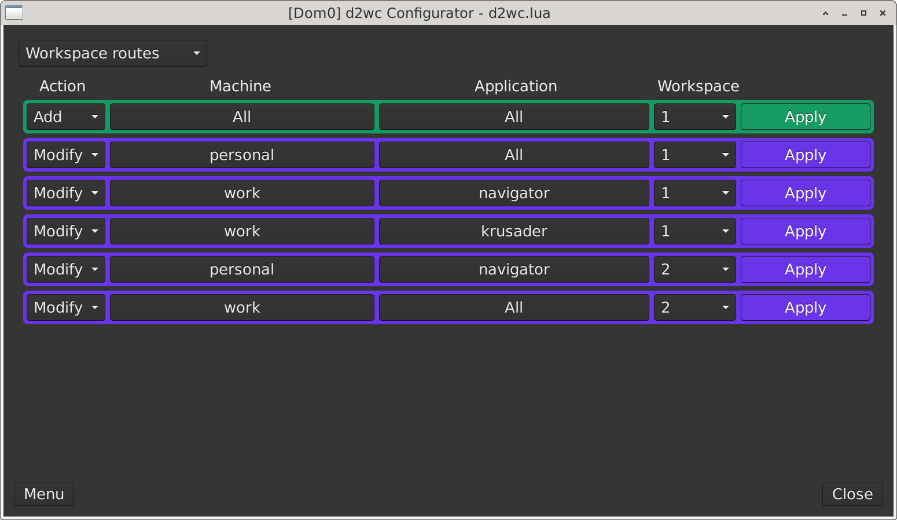
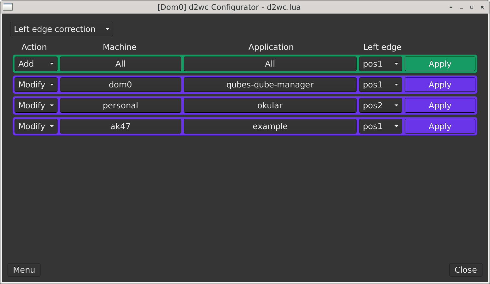

# User Documentation

Start here:

1. [Install/Update for Qubes](install-qubes.md) explains how to install or update `d2wc` in Qubes dom0.
2. [Lua Configurables](lua-configurables.md) explains the window behavior users can configure through `d2wc`.
3. [Backups](backups.md) explains where automatic backup archives are stored and what restore support exists now.

## Configurator screenshots

The screenshots below follow the configurator workflow selector order.

### Exclude

Creates rules for windows that `d2wc` should leave alone.

### Pin

Creates rules for windows that should appear on every workspace.

### Workspace routes

Creates rules that send matching windows to a chosen workspace.

### Window geometry

Creates and edits named position and size profiles.

### Workspace placement

Creates rules that apply a geometry profile to matching windows.

### Left edge correction

Creates rules for windows that need left-edge placement adjustment.

Project and implementation notes live separately under [`docs/project/`](../project/).
