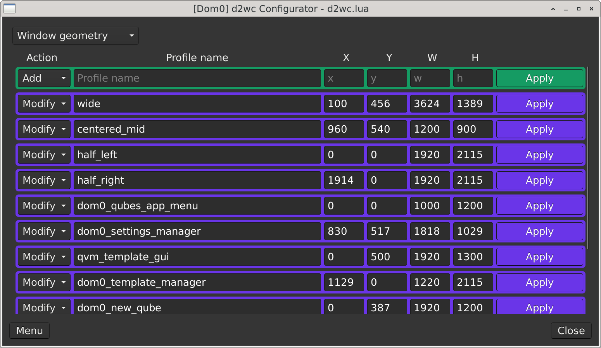
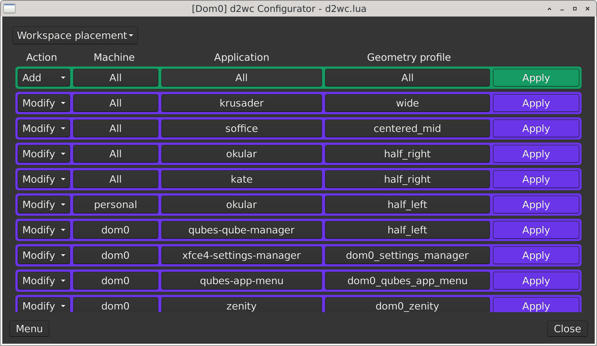

# Bundled Templates

`d2wc` ships with two bundled managed Lua templates so a new install starts with a layout that better matches the user's display size.

The bundled choices are:

1. `2160`
2. `1080`

The `1080` template is based on the `2160` template, but scaled down by a factor of `0.5`. While this is mathematically sound, other variables like window border width also play a role. The `2160` template specifically uses the `Default-hdpi` theme in `appMenu -> gear icon -> System Settings -> Window Manager`.

The `1080` template is still only a starting point. Different desktops, themes, window borders, font sizes, and display layouts can make the same values feel slightly different from one system to another. The goal is not to make every window perfect immediately. The goal is to make the first install usable, then let you fine-tune from there.

After installation, geometry profiles can be adjusted in the Window geometry workflow:

Profiles can then be linked to `Applications` using the `Workspace placement` workflow.

