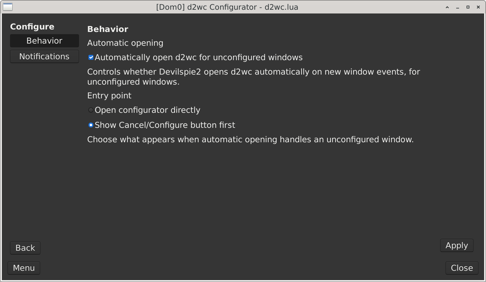
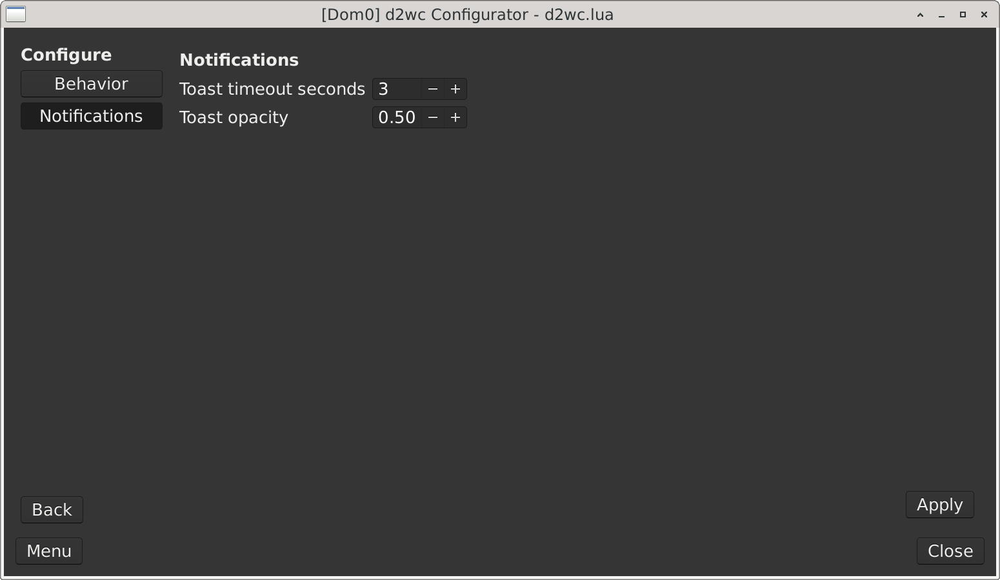

# Configurator Options

The configurator options screen controls how `d2wc` behaves while you are using the GTK configurator and while Devilspie2 reports new windows.

Open it from the main configurator window:

```text
Menu -> Configure
```

The options screen has two sections:

1. `Behavior`
2. `Notifications`

Use `Back` to return to the normal rule editor.

## Behavior



`Behavior` controls what happens when Devilspie2 sees a normal application window that is not already handled by your `d2wc` managed rules.

### Automatically open d2wc for unconfigured windows

When this option is enabled, Devilspie2 can open `d2wc` automatically for new normal application windows that do not already match a managed rule.

This is useful during initial setup because `d2wc` can appear when an application opens and offer a way to configure it.

When this option is disabled, new window events do not open `d2wc` automatically. You can still open the configurator manually with:

```bash
d2wc
```

or with a keyboard shortcut that launches `d2wc`.

### Window event action

This option controls what `d2wc` opens when automatic window-event behavior is enabled.

Available choices:

1. `Open configurator directly`
2. `Show Cancel/Configure button first`

#### Open configurator directly

This opens the full configurator when an unconfigured normal window appears.

Use this when you want the fastest setup workflow and you are comfortable with the configurator opening automatically.

#### Show Cancel/Configure button first

This shows a small prompt first.

The prompt has two buttons:

1. `Cancel`
2. `Configure`

Choose `Cancel` when you do not want to configure that window.

Choose `Configure` to open the full configurator for that window.

This is useful when you want automatic help for new windows, but you do not want the full configurator to open immediately every time.

## Notifications



`Notifications` controls the small success messages shown by the configurator after actions complete.

These settings do not change your Devilspie2 rules. They only affect how configurator messages are displayed.

### Toast timeout

`Toast timeout` controls how long success messages stay visible.

Use a shorter timeout if messages stay on screen longer than you prefer.

Use a longer timeout if messages disappear before you have time to read them.

### Toast opacity

`Toast opacity` controls how solid or transparent success messages appear.

A higher value makes messages more solid.

A lower value makes messages more transparent.

## What these options change

The Behavior options are saved into the active managed Lua file because Devilspie2 needs those settings while it is handling window events.

The Notifications options are saved as configurator preferences under:

```text
~/.config/d2wc/settings.json
```

Changing notification settings does not change window placement rules.
